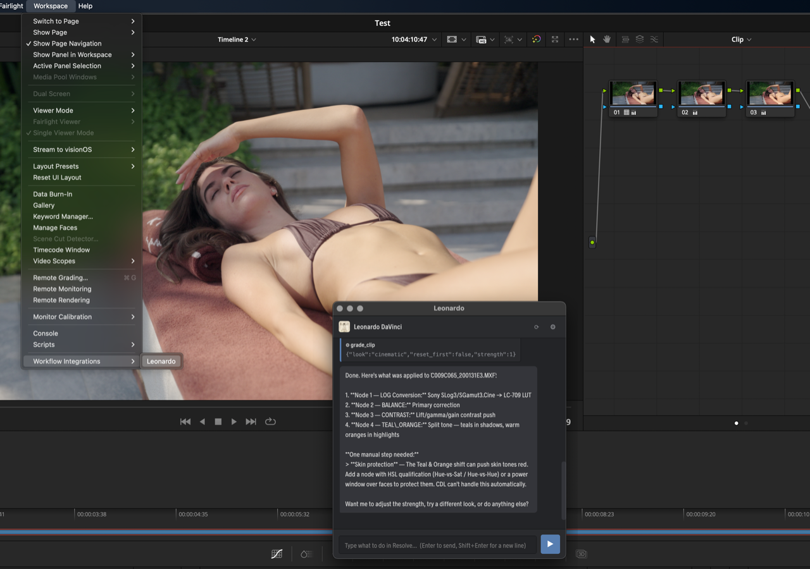

# Leonardo — a Claude chat inside DaVinci Resolve



**Leonardo** is a chat panel that lives **inside DaVinci Resolve Studio**. You type what you
want in plain language, and Leonardo (powered by Claude) actually does it — switching pages,
importing media, cutting and rippling the timeline, building color-grade node trees, detecting
the camera and converting LOG footage, rendering, and more.

It is a **Workflow Integration plugin** (an Electron panel Resolve loads from
*Workspace → Workflow Integrations*), not an OFX effect. OFX only processes pixels of a frame
and has no access to the timeline, media pool or render queue — so it cannot drive the app.
Leonardo talks to Resolve through its scripting API plus UI automation, giving it ~84 tools.

> Demo above: `grade_clip` built a 4‑node cinematic grade (Sony S‑Log3 → Rec.709 conversion,
> balance, contrast, teal‑&‑orange) and told the user which steps still need a human (skin
> protection via HSL), all from one sentence in the chat.

---

## Download & install (quickest)

1. Download **[Install Leonardo.zip](Install%20Leonardo.zip)** from this repo and unzip it.
2. Double‑click **Install Leonardo.app** → approve the admin prompt. It copies the plugin into
   Resolve's *Workflow Integration Plugins* folder and the matching `WorkflowIntegration.node`
   from your installed Resolve.
3. In Resolve: **Preferences → General → External scripting using = Local**, then restart Resolve.
4. **Workspace → Workflow Integrations → Leonardo**.
5. Click **⚙** and either paste an **Anthropic API key**, or switch to **Max** to use your
   Claude subscription (see below).

Requirements: **DaVinci Resolve Studio** (the free edition has no Workflow Integrations),
macOS, and either an Anthropic API key or a Claude Pro/Max subscription.

---

## Two “brain” modes

Open **⚙** and pick one:

- **API key** — direct Anthropic Messages API (pay‑per‑token). Paste your `sk-ant-…` key.
- **Max (subscription)** — drives your locally installed `claude` CLI (Claude Code) on your
  Claude Max/Pro subscription; Leonardo's tools are exposed to it over a local MCP bridge.
  Run `claude setup-token` once (or rely on an existing Claude Code login).

The key / token is stored locally in `~/.leonardo.json` (mode `600`) and never leaves your machine.

---

## What it can do

- **Control:** switch pages, projects, media pool / bins, import media, timelines, markers, render.
- **Editing:** list/inspect clips, set playhead, blade at playhead, ripple/lift delete, trim‑on‑insert,
  tracks, compound clips, scene‑cut detection, titles.
- **Color grading:** `grade_clip` builds a node tree on the Color page and applies ASC‑CDL / LUTs
  from a library of looks (clean, teal‑&‑orange, warm, cool, filmic, vintage, b&w, bright, moody,
  bleach bypass). It always reports the manual steps the API can't do (curves, HSL, power windows).
- **Camera / LOG:** `detect_camera` reads clip metadata to identify the camera (Sony S‑Log3, Panasonic
  V‑Log, ARRI LogC, Canon Log, RED Log3G10, BMD Film, DJI D‑Log…) and `apply_log_profile` converts
  LOG → Rec.709 with the right conversion LUT or input color space.
- **Fusion / audio / project:** Fusion comps, voice isolation, transcription, subtitles, project &
  render settings, render‑queue management, timeline export (AAF/EDL/XML/FCPXML/OTIO…).
- **Universal control:** `run_menu_command`, `press_shortcut` (knows the default keymap),
  `type_text` — anything a human can do in the UI.
- **System super‑tools:** `run_shell`, `run_python` (the **full** Resolve Python API), `run_applescript`,
  file I/O, `http_request`, `open_path` — for transcoding, file organization and anything beyond Resolve.

### Example prompts

- “what's open right now?” · “switch to the Color page”
- “import /Users/me/clips/a.mov and b.mov and build a timeline”
- “cut the middle out of clip 2 with ripple”
- “what camera was this shot on?” → “remove the LOG, it's Sony” → “make it warm and cinematic”
- “transcode the current render to ProRes with ffmpeg”

---

## Build / install from source

```bash
git clone https://github.com/glebxxx/leonardo.git
cd leonardo
./fonts/download-fonts.sh      # optional: fetches the Radnika brand font (see Fonts below)
./build-installer.sh           # builds ../Install Leonardo.app  →  double-click it
# or, from a terminal:
./install.sh
```

No Node/npm needed — the panel calls the Anthropic API via the runtime's built‑in `fetch`, and
the Max‑mode MCP proxy is pure‑Python (stdlib only).

## Fonts

The UI is styled to match the DaVinci interface and uses Blackmagic's **Radnika** brand font.
Those font files are **not** redistributed here; run `fonts/download-fonts.sh` to fetch them from
Blackmagic's public CDN. Without them the panel simply falls back to the system font.

## Architecture (brief)

```
Resolve Studio ──launches──> main.js (Electron main)
  ├─ WorkflowIntegration.node → Initialize() → GetResolve()   (live Resolve handle)
  ├─ apikey mode: agent/agentLoop.js + lib/anthropic.js (streaming Messages API, manual tool loop)
  ├─ max mode:    agent/claudeBackend.js → `claude` CLI  ⇄  mcp/leonardo_mcp.py  ⇄  agent/mcpBridge.js
  ├─ agent/tools.js (84 schemas) + agent/*Tools.js (handlers) → agent/resolveTools.js dispatch
  └─ BrowserWindow ← preload.js (contextBridge) ← index.html / renderer.js (chat UI)
```

## Security

The system tools give the assistant real access to your machine (shell, Python, files). They run
in the Electron main process and are reachable only through the chat loop (the renderer is
sandboxed). The system prompt instructs Leonardo to confirm destructive/irreversible actions before
running them. Use accordingly.

## Acknowledgements

Built for **DaVinci Resolve by Blackmagic Design**. This project relies on Blackmagic's
Workflow Integration SDK and the DaVinci Resolve scripting API, and is styled with Blackmagic's
**Radnika** brand font. *DaVinci Resolve*, *Blackmagic Design* and *Radnika* are trademarks of
Blackmagic Design Pty Ltd. Leonardo is an **unofficial, independent** project — not affiliated
with, sponsored by, or endorsed by Blackmagic Design.

## License

GPL‑3.0
